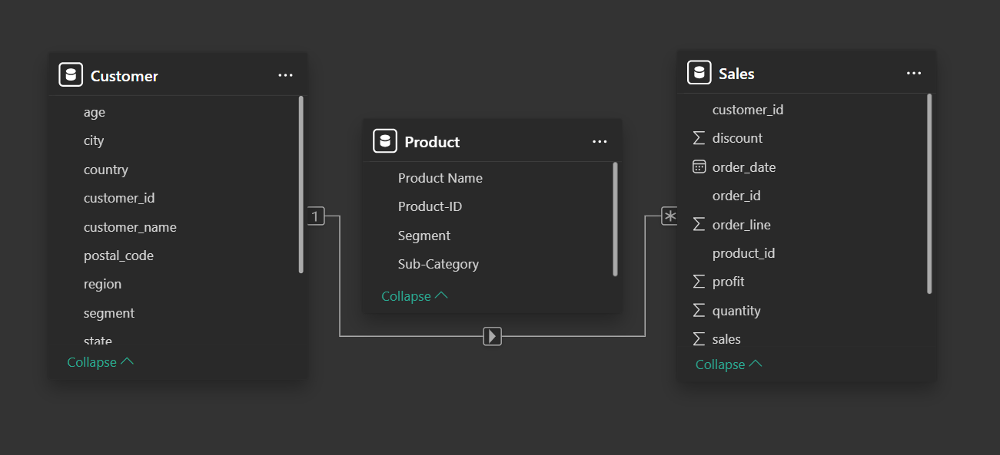
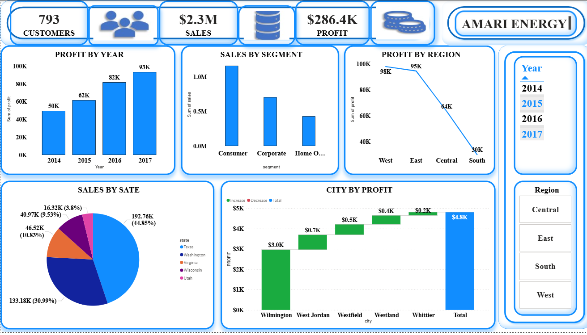

# ⚡ AMARI ENERGY Sales & Profit Dashboard

An advanced business intelligence dashboard built with Excel and Power BI, analyzing customer behavior, regional performance, and profitability across multiple dimensions. Data sourced from Kaggle and modeled using high-end analytics tools.

---

## 🧩 Table of Contents
1. [📘 Introduction](#-introduction)
2. [⚙️ Problem Statement](#-problem-statement)
3. [🧠 Skills Demonstrated](#-skills-demonstrated)
4. [📥 Data Sourcing](#-data-sourcing)
5. [🔄 Data Transformation](#-data-transformation)
6. [🧩 Modelling](#-modelling)
7. [📈 Analysis & Visualizations](#-analysis--visualizations)
8. [💡 Insights & Problems Solved](#-insights--problems-solved)
9. [🧾 Conclusion & Recommendations](#-conclusion--recommendations)

---

## 📘 Introduction
This dashboard provides a comprehensive view of AMARI ENERGY’s performance across customer segments, regions, and time. It empowers stakeholders to monitor KPIs, uncover trends, and make data-driven decisions using Excel and Power BI.

---

## ⚙️ Problem Statement
The company lacked a unified reporting system to track customer distribution, regional profitability, and product performance. Static spreadsheets made it difficult to extract actionable insights across years and locations.

---

## 🧠 Skills Demonstrated
- Power BI Data Modeling  
- Excel Power Query  
- DAX Calculations  
- KPI Design & Formatting  
- Business Intelligence Storytelling  

---

## 📥 Data Sourcing
Data was sourced from Kaggle’s publicly available sales dataset, including:
- Customer demographics and location  
- Product categories and sub-categories  
- Sales transactions with profit and discount metrics  
- Time-based fields (Order Date, Year)  

---

## 🔄 Data Transformation
- Cleaned and standardized region, segment, and state fields  
- Created calculated columns for profit margin and customer density  
- Filtered nulls and duplicates for model integrity  
- Added time intelligence fields for year-over-year analysis

---

## 🧩 Modelling

📊 Click to view entity-relationship model

**Data Model Type:** ⭐ **Star Schema**

**Fact Table:**
- `Sales`: order date, quantity, discount, profit, customer_id, product_id  

**Dimension Tables:**
- `Customer`: age, city, country, region, segment  
- `Product`: product name, product ID, sub-category  

**Relationships:**
- `Customer.customer_id` → `Sales.customer_id`  
- `Product.product_id` → `Sales.product_id`  

📷 

---

## 📈 Analysis & Visualizations

📊 Click to expand dashboard overview

**Top KPIs:**
- Customers: 793  
- Sales: $2.3M  
- Profit: $286.4K  

**Visuals Include:**
- Profit by Year: Bar chart (2014–2017)  
- Sales by Segment: Bar chart (Consumer, Corporate, Home Office)  
- Profit by Region: Line chart (West, East, Central, South)  
- Sales by State: Pie chart (CA, NY, TX, WA, MA, Others)  
- City by Profit: Bar chart (Wilmington, West Jordan, Windermere, etc.)  
- Filters: Year and Region slicers  

📷 

---

## 💡 Insights & Problems Solved
- **Consumer segment** drove over 75% of total sales  
- **East region** outperformed others in profit margin  
- **California and New York** led in state-level sales  
- **Wilmington and West Jordan** emerged as high-profit cities  
- Enabled dynamic filtering by year and region for targeted analysis

---

## 🧾 Conclusion & Recommendations
This dashboard enables AMARI ENERGY to:
- Focus marketing efforts on high-performing states and cities  
- Reevaluate product strategy in underperforming regions  
- Expand inventory for high-profit sub-categories  
- Monitor year-over-year growth and regional trends  

---

## 📂 Files

| File | Description |
|------|-------------|
| [`AMARI_ENERGY.pbix`](./AMARI_ENERGY.pbix) | Power BI dashboard file |
| [`Previews/AmariEnergy_Dashboard.png`](./`Previews/AmariEnergy_Dashboard.png) | Dashboard preview |
| [`Previews/AmariEnergy_Model.png`](./Previews/AmariEnergy_Model.png) | Entity-Relationship Diagram |

---

## 💬 Author

**Uche Nelson**  
📧 [uchenelson9010@gmail.com](mailto:uchenelson9010@gmail.com)  
🔗 [LinkedIn](https://www.linkedin.com/in/uche-chukwuemeka-nelson/)  
🌐 [Portfolio](https://datascienceportfol.io/UcheNelson)
