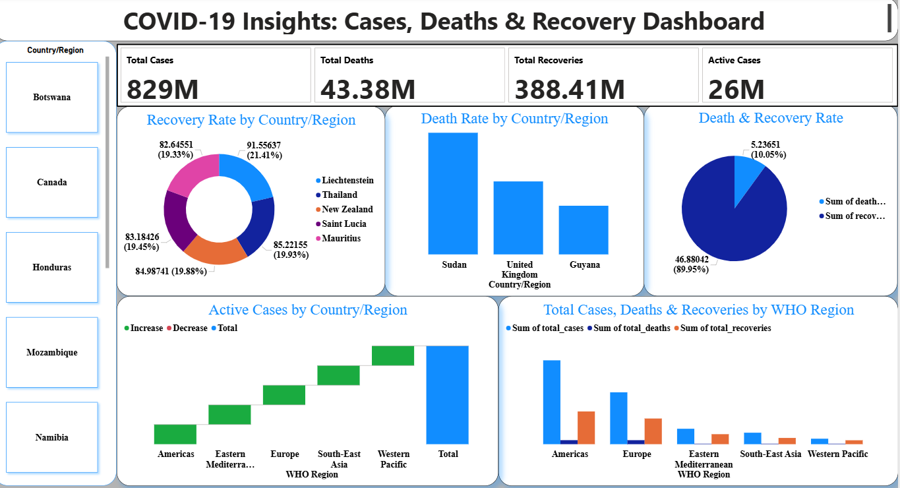

# 🦠 COVID-19 Insights Dashboard  

An interactive Power BI project analyzing global COVID-19 trends — total cases, deaths, recoveries, and active cases across countries and WHO regions.  
Built using **SQL**, **Excel**, and **Power BI**, this dashboard transforms raw pandemic data into actionable health insights.  

---

## 📋 Table of Contents  
1. [Introduction](#introduction)  
2. [Problem Statement](#problem-statement)  
3. [Skills Demonstrated](#skills-demonstrated)  
4. [Data Sourcing](#data-sourcing)  
5. [Data Transformation](#data-transformation)  
6. [Modelling](#modelling)  
7. [Analysis & Visualizations](#analysis--visualizations)  
8. [Insights & Problems Solved](#insights--problems-solved)  
9. [Conclusion & Recommendations](#conclusion--recommendations)  
10. [Tools Used](#tools-used)  
11. [Files](#files)  
12. [Author](#author)  

---

## 1️⃣ Introduction  
The **COVID-19 Insights Dashboard** provides a visual breakdown of the pandemic’s global impact.  
It helps users understand infection trends, recovery rates, and regional disparities in real time — allowing for data-driven decision-making and comparative analysis across countries.  

---

## 2️⃣ Problem Statement  
The global COVID-19 dataset contained millions of raw records without intuitive visibility into key indicators.  
Health professionals and policy makers needed a consolidated dashboard to:  
- Track total cases, deaths, and recoveries by country and WHO region.  
- Compare performance between continents.  
- Identify regions with slow recovery or high fatality rates.  

---

## 3️⃣ Skills Demonstrated  
- SQL Data Extraction & Filtering  
- Data Cleaning and Preparation (Excel, Power Query)  
- Data Modelling (Star Schema)  
- DAX Calculations and Measures  
- Power BI Dashboard Design  
- Analytical Storytelling and Insight Communication  

---

## 4️⃣ Data Sourcing  
**Source:** [Kaggle – COVID-19 Global Dataset](https://www.kaggle.com/)  
- Dataset includes daily country-level data: Confirmed Cases, Deaths, Recoveries, Active Cases, and WHO Region.  
- Data was imported first into **SQL** for initial querying and validation before being connected to **Power BI** for analysis.  

---

## 5️⃣ Data Transformation  
Performed in **SQL** and **Power Query**:  
- Removed duplicates and nulls.  
- Created calculated columns:  
  - **Active Cases** = Confirmed − (Recovered + Deaths)  
  - **Recovery Rate (%)** = (Recovered / Confirmed) × 100  
  - **Death Rate (%)** = (Deaths / Confirmed) × 100  
- Grouped data by **WHO Region** for regional summaries.  
- Standardized column naming and formats for integration.  

---

## 6️⃣ Modelling  
A **Star Schema** model was implemented for clear relationships between fact and dimension tables.  

📘 **Model Overview:**  
- **Fact Table:** COVID-19 daily records (cases, deaths, recoveries).  
- **Dimension Tables:** Country/Region, WHO Region, Death Rate %, Recovery Rate %.  

📊 **Data Model Preview**  
  

---

## 7️⃣ Analysis & Visualizations  
Key visuals used:  
- **KPI Cards** — Total Cases (829M), Deaths (43.38M), Recoveries (388.41M), Active Cases (26M)  
- **Donut Charts** — Recovery Rate by Country  
- **Bar Charts** — Death Rate by Country, Regional Case Comparison  
- **Clustered Columns** — Total Cases, Deaths, and Recoveries by WHO Region  
- **Slicers** — Interactive filters by Country and WHO Region  

📊 **Dashboard Preview**  
  

---

## 8️⃣ Insights & Problems Solved  
This analysis addressed critical questions and produced actionable insights:  

| Problem | Analytical Insight |
|----------|--------------------|
| Which regions had the highest infection and fatality rates? | The **Americas** and **Europe** recorded the most cases and deaths. |
| How do recovery trends compare across countries? | **Liechtenstein**, **New Zealand**, and **Mauritius** showed recovery rates above 90%. |
| Where were active cases still rising? | Concentrated growth in the **Americas** and **Western Pacific** regions. |
| What was the overall recovery-to-death ratio? | Roughly **9 recoveries : 1 death**, indicating strong recovery in most nations. |

✅ **Problem Solved:** The dashboard transformed raw, disorganized COVID-19 data into a clear visual tool that aids global comparison, public-health evaluation, and policy planning.  

---

## 9️⃣ Conclusion & Recommendations  
- Power BI offers a reliable approach for tracking global pandemics through visual analytics.  
- Real-time regional breakdowns help governments allocate medical resources effectively.  
- Integrating **vaccination** and **testing-rate** data could enhance the analytical depth.  
- Future enhancements: forecasting models using SQL-powered datasets and Power BI predictive visuals.  

---

## 🧰 Tools Used  
| Tool | Purpose |
|------|----------|
| **SQL** | Querying, cleaning, and preprocessing the dataset |
| **Excel** | Preliminary data checks and summary sheets |
| **Power BI** | Modelling, DAX calculations, visualization |
| **Kaggle** | Source of raw COVID-19 dataset |

---

## 📎 Files  
| File | Description |
|------|-------------|
| [`Covid-19_Insights.pbix`](./Covid-19_Insights.pbix) | Main Power BI dashboard file |
| [`Covid-19_Data.sql`](./Covid-19_Data.sql) | SQL script for extraction and cleaning |
| [`Covid-19_Data.xlsx`](./Covid-19_Data.xlsx) | Cleaned dataset |
| [`Screenshots/Covid-19_Insight_Dashboard.png`](./Screenshots/Covid-19_Insight_Dashboard.png) | Dashboard screenshot |
| [`Screenshots/Covid-19_Insight_Model.png`](./Screenshots/Covid-19_Insight_Model.png) | Data model relationship diagram |

---

## 👨‍💻 Author  
**Uche Nelson**  
_Data Analyst | SQL | Power BI | Excel | Python_  
📧 [uchenelson9010@gmail.com](mailto:uchenelson9010@gmail.com)  
🔗 [LinkedIn](https://www.linkedin.com/in/uche-chukwuemeka-nelson/)  
🔗 [Portfolio](https://datascienceportfol.io/UcheNelson)

---

⭐ **If you find this project insightful, please give it a star on GitHub!**
