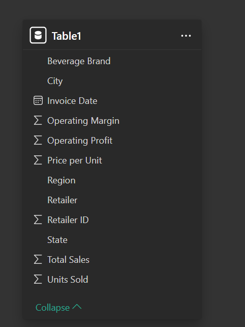
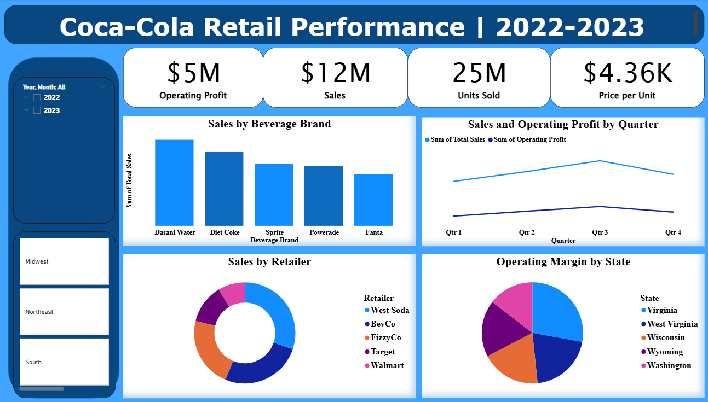

# 🥤 Coca-Cola Retail Performance Dashboard | 2022–2023

An interactive Power BI dashboard analyzing Coca-Cola’s retail performance across brands, states, quarters, and retailers. Built using sourced data from X and modeled with a Flat Schema for efficient analysis and storytelling.

---

## 🧩 Table of Contents
1. [📘 Introduction](#-introduction)
2. [⚙️ Problem Statement](#-problem-statement)
3. [🧠 Skills Demonstrated](#-skills-demonstrated)
4. [📥 Data Sourcing](#-data-sourcing)
5. [🔄 Data Transformation](#-data-transformation)
6. [🧩 Modelling](#-modelling)
7. [📈 Analysis & Visualizations](#-analysis--visualizations)
8. [💡 Insights & Problems Solved](#-insights--problems-solved)
9. [🧾 Conclusion & Recommendations](#-conclusion--recommendations)

---

## 📘 Introduction
This dashboard provides a comprehensive view of Coca-Cola’s retail performance across beverage brands, geographic regions, and time. It empowers stakeholders to monitor KPIs, uncover trends, and optimize retail strategy.

---

## ⚙️ Problem Statement
Coca-Cola needed a centralized reporting tool to evaluate brand-level sales, retailer contributions, and regional operating margins. Traditional reports lacked the flexibility for multi-dimensional analysis and time-based comparisons.

---

## 🧠 Skills Demonstrated
- Power BI Data Modeling  
- DAX Calculations  
- KPI Design & Conditional Formatting  
- Time Series Analysis  
- Retail Segmentation  
- Business Intelligence Storytelling  

---

## 📥 Data Sourcing
Data was sourced from X (Formerly Twitter), including:
- Beverage brand performance  
- Retailer sales and IDs  
- State-level operating margins  
- Quarterly financial metrics  
- Units sold and price per unit  

---

## 🔄 Data Transformation
- Standardized brand and retailer names  
- Created calculated columns for operating margin and quarterly trends  
- Filtered nulls and duplicates  
- Added time intelligence fields (Invoice Date, Quarter, Year)

---

## 🧩 Modelling

📊 Click to view entity-relationship model

**Data Model Type:** ⭐ **Flat Schema**

**Fact Table:**
- `Table1`: invoice date, units sold, total sales, operating profit, operating margin, retailer ID, beverage brand  

**Dimension Tables (Implied):**
- `Retailer`: retailer name, city, state, region  
- `Product`: beverage brand, price per unit  
- `Time`: invoice date, quarter, year  

📷 

---

## 📈 Analysis & Visualizations

📊 Click to expand dashboard overview

**Top KPIs:**
- Operating Profit: $5M  
- Sales: $12M  
- Units Sold: 25M  
- Price per Unit: $4.36K  

**Visuals Include:**
- Sales by Beverage Brand: Bar chart (Dasani, Diet Coke, Sprite, etc.)  
- Sales & Operating Profit by Quarter: Line chart (Q1–Q4)  
- Sales by Retailer: Pie chart (Walmart, Target, 7-Eleven, etc.)  
- Operating Margin by State: Pie chart (WV, VA, PA, OH)  
- Filters: Year, Month, Area  

📷 

---

## 💡 Insights & Problems Solved
- **Dasani Water** led in beverage brand sales  
- **Walmart and Target** were top-performing retailers  
- **West Virginia and Virginia** showed strong operating margins  
- **Q4** delivered the highest operating profit  
- Enabled dynamic filtering by year, region, and retailer for targeted analysis

---

## 🧾 Conclusion & Recommendations
This dashboard enables Coca-Cola to:
- Prioritize high-performing brands and retailers  
- Optimize pricing strategies based on quarterly trends  
- Expand distribution in high-margin states  
- Monitor year-over-year growth and regional performance  

---

## 📂 Files

| File | Description |
|------|-------------|
| [`Cocacola_Data.pbix`](./Cocacola_Data.pbix) | Power BI dashboard file |
| [`Screenshots/Cocacola_Dashboard.png`](./Screenshots/Cocacola_Dashboard.png) | Dashboard preview |
| [`Screenshots/Cocacola_Model.png`](./Screenshots/Cocacola_Model.png) | Data model screenshot |

---

## 💬 Author

**Uche Nelson**  
📧 [uchenelson9010@gmail.com](mailto:uchenelson9010@gmail.com)  
🔗 [LinkedIn](https://www.linkedin.com/in/uche-chukwuemeka-nelson/)  
🌐 [Portfolio](https://datascienceportfol.io/UcheNelson)
