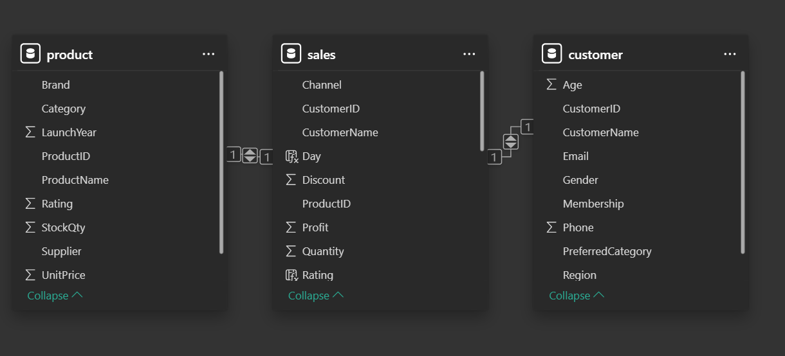
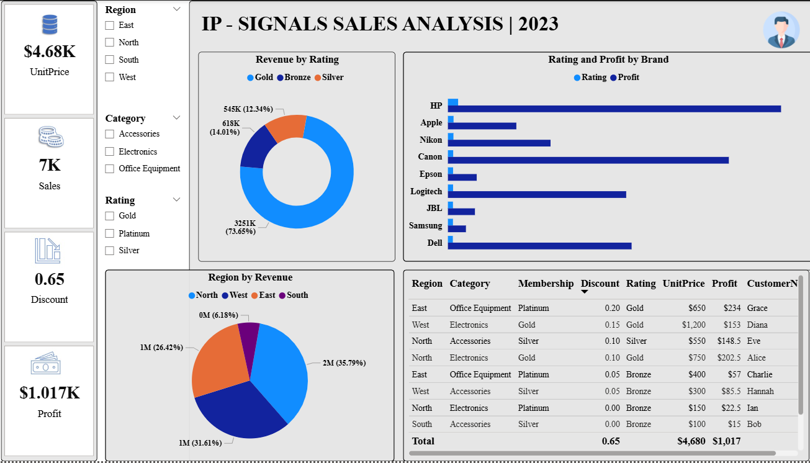

# 📡 IP SIGNALS SALES ANALYSIS | 2023

An interactive Power BI dashboard analyzing sales performance across regions, brands, categories, and customer ratings. Built using locally sourced data and modeled with a Star Schema for optimal analytical depth.

---

## 🧩 Table of Contents
1. [📘 Introduction](#-introduction)
2. [⚙️ Problem Statement](#-problem-statement)
3. [🧠 Skills Demonstrated](#-skills-demonstrated)
4. [📥 Data Sourcing](#-data-sourcing)
5. [🔄 Data Transformation](#-data-transformation)
6. [🧩 Modelling](#-modelling)
7. [📈 Analysis & Visualizations](#-analysis--visualizations)
8. [💡 Insights & Problems Solved](#-insights--problems-solved)
9. [🧾 Conclusion & Recommendations](#-conclusion--recommendations)

---

## 📘 Introduction
This dashboard provides a comprehensive view of IP SIGNALS’ sales metrics, customer segmentation, brand performance, and regional distribution. It enables stakeholders to explore profitability, discount behavior, and customer loyalty across multiple dimensions.

---

## ⚙️ Problem Statement
The company needed a dynamic reporting tool to uncover brand-level profitability, regional revenue distribution, and customer rating impact. Traditional spreadsheets lacked the flexibility for multi-dimensional analysis.

---

## 🧠 Skills Demonstrated
- Power BI Data Modeling  
- DAX Calculations  
- KPI Design & Conditional Formatting  
- Relationship Mapping (Star Schema)  
- Interactive Visual Design  
- Business Intelligence Storytelling  

---

## 📥 Data Sourcing
Data was sourced locally from internal Excel files and CSV exports, including:
- Product details (brand, category, rating, unit price)  
- Customer demographics and membership levels  
- Sales transactions with profit, discount, and quantity metrics  
- Time-based fields (day, launch year)

---

## 🔄 Data Transformation
- Standardized brand and category names  
- Created calculated columns for average discount and profit margin  
- Filtered nulls and duplicates  
- Added rating-based segmentation and membership tiers

---

## 🧩 Modelling

📊 Click to view entity-relationship model

**Data Model Type:** ⭐ **Star Schema**

**Fact Table:**
- `Sales`: channel, customer_id, product_id, quantity, discount, profit, rating, day  

**Dimension Tables:**
- `Customer`: age, gender, region, membership, preferred category  
- `Product`: brand, category, launch year, unit price, rating, supplier  

**Relationships:**
- `Customer.customer_id` → `Sales.customer_id`  
- `Product.product_id` → `Sales.product_id`  

📷 

---

## 📈 Analysis & Visualizations

📊 Click to expand dashboard overview

**Top KPIs:**
- Unit Price: $4.68K  
- Discount: 0.65  
- Profit: $1.017K  
- Sales: 7K  

**Visuals Include:**
- Rating by Revenue: Pie chart (Gold, Silver, Bronze)  
- Rating & Profit by Brand: Bar chart (HP, Apple, Canon, JBL, etc.)  
- Region by Revenue: Pie chart (North, West, East, South)  
- Detailed Sales Table: Region, Category, Membership, Rating, Profit, Customers  

📷 

---

## 💡 Insights & Problems Solved
- **Gold-rated customers** contributed over 60% of total revenue  
- **North, West, and East regions** each generated over $1M in revenue  
- **HP and Apple** led in brand-level profitability  
- **Platinum members** showed higher unit prices and profit margins  
- Enabled segmentation by rating, region, and membership for targeted analysis

---

## 🧾 Conclusion & Recommendations
This dashboard empowers IP SIGNALS to:
- Prioritize high-performing brands and customer tiers  
- Optimize discount strategies based on rating and region  
- Expand inventory for Gold-rated segments  
- Monitor regional performance for strategic expansion  

---

## 📂 Files

| File | Description |
|------|-------------|
| [`IP-Signals.pbix`](./IP-Signals.pbix) | Power BI dashboard file |
| [`Assets/IP-Signals_Dashboard.png`](./Assets/IP-Signals_Dashboard.png) | Dashboard preview |
| [`Assets/IP-Signals_Model.png`](./Assets/IP-Signals_Model.png) | Entity-Relationship Diagram |

---

## 💬 Author

**Uche Nelson**  
📧 [uchenelson9010@gmail.com](mailto:uchenelson9010@gmail.com)  
🔗 [LinkedIn](https://www.linkedin.com/in/uche-chukwuemeka-nelson/)  
🌐 [Portfolio](https://datascienceportfol.io/UcheNelson)
