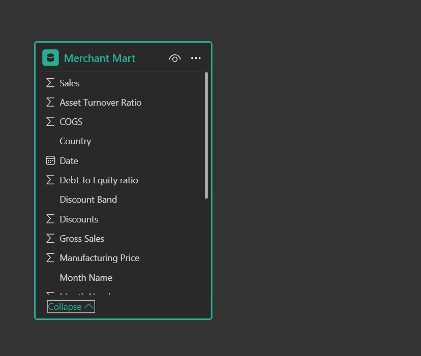
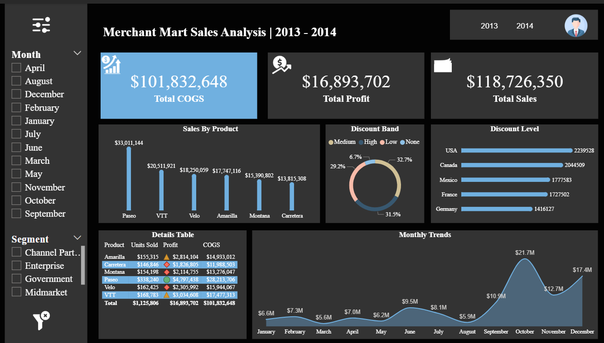

# 📊 Merchant Mart Sales Analysis Dashboard

An interactive Power BI dashboard analyzing sales performance across products, countries, discount levels, and time. Built for strategic insights using locally sourced data from Merchant Mart’s internal systems.

---

## 🧩 Table of Contents
1. [📘 Introduction](#-introduction)
2. [⚙️ Problem Statement](#-problem-statement)
3. [🧠 Skills Demonstrated](#-skills-demonstrated)
4. [📥 Data Sourcing](#-data-sourcing)
5. [🔄 Data Transformation](#-data-transformation)
6. [🧩 Modelling](#-modelling)
7. [📈 Analysis & Visualizations](#-analysis--visualizations)
8. [💡 Insights & Problems Solved](#-insights--problems-solved)
9. [🧾 Conclusion & Recommendations](#-conclusion--recommendations)

---

## 📘 Introduction
This Power BI dashboard provides a comprehensive overview of Merchant Mart’s sales metrics from 2013 to 2014. It enables stakeholders to explore performance by product, geography, discount strategy, and monthly trends.

---

## ⚙️ Problem Statement
Merchant Mart needed a dynamic reporting tool to uncover sales drivers, evaluate discount effectiveness, and monitor performance across global markets. Static reports lacked the flexibility for deep analysis.

---

## 🧠 Skills Demonstrated
- Power Query
- Power BI Data Modeling  
- DAX Calculations  
- Interactive Visual Design  
- Time Series Analysis  
- KPI Tracking  
- Drill-through & Slicer Integration  

---

## 📥 Data Sourcing
Data was sourced locally from Merchant Mart’s internal Excel and CSV files, including:
- Sales transactions  
- Product categories  
- Country-level discount data  
- Monthly performance logs  
- Financial metrics (COGS, Profit, Asset Turnover)

---

## 🔄 Data Transformation
- Cleaned and normalized product and country names  
- Created calculated columns for profit margin and discount bands  
- Added time intelligence fields (Month Name, Year)  
- Filtered out incomplete records and duplicates

---

## 🧩 Modelling

📊 Click to view data model overview

**Key Fields:**
- Sales, COGS, Profit  
- Country, Month Name, Date  
- Discount Band, Product Category  
- Asset Turnover Ratio, Debt to Equity  
- Manufacturing Price, Channel Partner  

---

## 📈 Analysis & Visualizations

📊 Click to expand dashboard overview

**Dashboard Title:** Merchant Mart Sales Analysis | 2013 - 2014

**Top KPIs:**
- Total Sales: $118.7M  
- Total Profit: $16.9M  
- Total COGS: $101.8M  

**Visuals Include:**
- Sales by Product: Bar chart (Pens, VTT, Tables, Chairs, Racks)  
- Discount Band Distribution: Pie chart (Medium, High, Low)  
- Discount Level by Country: Bar chart (USA, Canada, Mexico, Germany, France)  
- Monthly Sales Trends: Line chart (Peak in November)  
- Segment & Channel Partner Table: Color-coded matrix  
- Filters: Month, Segment, Year toggle  

---

## 💡 Insights & Problems Solved
- **Pens and VTT** were top-selling products, driving over 50% of total sales  
- **Medium discount band** dominated, accounting for 54% of transactions  
- **USA and Canada** led in discount-driven sales volume  
- **November** marked the highest sales peak, indicating seasonal demand  
- **Consumer segment** showed strong performance across all months

---

## 🧾 Conclusion & Recommendations
This dashboard empowers Merchant Mart to:
- Optimize discount strategies by country  
- Focus inventory on high-performing products  
- Leverage seasonal trends for promotional planning  
- Monitor segment performance for targeted marketing  
- Improve financial ratios through cost control

---

## 📂 Files

| File | Description |
|------|-------------|
| [`Merchant_Mart.pbix`](./Merchant_Mart.pbix) | Power BI dashboard file |
| [`MerchantMart_Dashboard.png`](./MerchantMart_Dashboard.png) | Dashboard preview |
| [`MerchantMart_Model.png`](./MerchantMart_Model.png) | Data model screenshot |

---

## 💬 Author

**Uche Nelson**  
📧 [uchenelson9010@gmail.com](mailto:uchenelson9010@gmail.com)  
🔗 [LinkedIn](https://www.linkedin.com/in/uche-chukwuemeka-nelson/)  
🌐 [Portfolio](https://datascienceportfol.io/UcheNelson)
